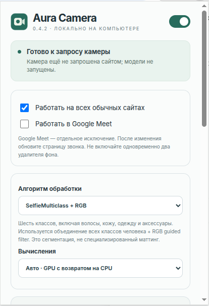
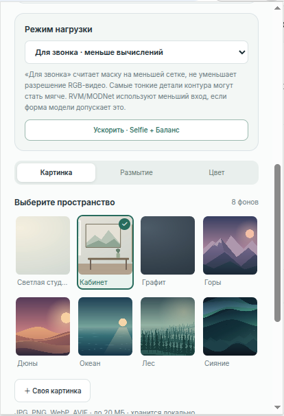
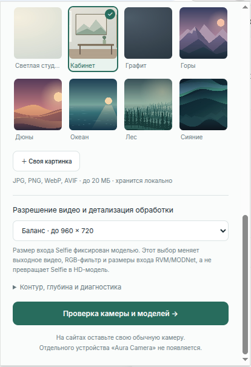

# Aura Camera

Aura Camera — расширение для Chrome, которое заменяет фон веб-камеры на картинку, размывает его или заливает цветом во время видеозвонка. Обработка выполняется локально на вашем компьютере. Сайт звонка по-прежнему получает видео от **обычной камеры**: отдельное устройство «Aura Camera» выбирать не нужно.

Версия 0.4.2 — тестовая сборка. Расширение работает на страницах HTTP/HTTPS, включая Google Meet. Оно не меняет камеру в отдельных приложениях и на внутренних страницах Chrome. Совместимость с каждым сайтом и скорость обработки зависят от браузера и компьютера.

## Как выглядит

| Настройки и выбор алгоритма | Фоны и режим нагрузки | Качество и проверка камеры |
| --- | --- | --- |
|  |  |  |

На скриншотах показаны примеры настроек; выбранный фон и переключатели могут отличаться от настроек новой установки.

## Установка с нуля

Понадобятся **настольный Chrome 119 или новее**, **Python 3.10 или новее** и интернет для первой загрузки моделей. Node.js, `pip` и сборка WASM не нужны. Установка не требует `sudo`.

1. Скачайте архив исходного кода через **Code → Download ZIP** на [странице проекта](https://github.com/lamooof/aura-camera) и распакуйте его. Можно также выполнить `git clone https://github.com/lamooof/aura-camera.git`. Дальнейшие команды запускайте **в папке с `prepare.py` и подпапкой `extension`**.
2. Подготовьте две модели Selfie и необходимые библиотеки:

   ```bash
   python3 prepare.py
   python3 prepare.py --check
   ```

   На Windows, если команда `python3` недоступна, используйте `py -3` вместо `python3`. Скрипт скачает зависимости в папку расширения и проверит файлы. При ошибке сети повторите первую команду: уже загруженные файлы останутся в `.cache`.
3. Откройте `chrome://extensions`, включите **Режим разработчика**, нажмите **Загрузить распакованное расширение** и выберите именно подпапку **`extension`** внутри подготовленной папки Aura Camera. Если Chrome уже показывает другую копию Aura Camera, отключите её.
4. Закрепите значок Aura Camera на панели Chrome и откройте его. Нажмите **Проверка камеры и моделей**, затем **Включить предпросмотр** и разрешите доступ к камере. Проверьте фон до звонка. Кнопка **Проверить все модели** отдельно проверяет запуск скачанных моделей на синтетических кадрах.
5. Откройте или обновите страницу звонка и выберите свою обычную камеру в настройках сайта. Если камера уже была включена, выключите её и включите снова. Не включайте одновременно эффект Aura Camera и удаление фона самого сайта.

По умолчанию выбран **SelfieMulticlass + RGB**, фон «Светлая студия», качество «Баланс» и режим нагрузки «Для звонка». Обработка обычных сайтов и Google Meet включена; для Meet есть отдельный переключатель. Настройки сохраняются локально в Chrome.

### Дополнительные модели

Команда `python3 prepare.py --all` загружает все пять вариантов: Selfie, SelfieMulticlass, RVM, MODNet и экспериментальный режим с глубиной MiDaS. Дополнительные модели и ONNX Runtime увеличивают объём загрузки и могут сильнее нагружать компьютер. После подготовки выполните `python3 prepare.py --check` и нажмите **↻** у расширения на странице `chrome://extensions`. Устанавливать вторую копию расширения не нужно.

## Использование

1. Откройте значок Aura Camera. Главный переключатель вверху включает или выключает замену фона.
2. Выберите **Картинка**, **Размытие** или **Цвет**. В режиме картинки доступны восемь встроенных фонов и кнопка **Своя картинка** (JPG, PNG, WebP или AVIF до 20 МБ).
3. При необходимости смените алгоритм, качество и режим нагрузки. Начните с настроек по умолчанию. Если видео тормозит, нажмите **Ускорить · Selfie + Баланс** или выберите «Экономный».
4. Проверьте результат через **Проверка камеры и моделей**. После изменения переключателей сайтов или Google Meet остановите камеру и обновите страницу звонка.

**Антимерцание маски** сглаживает небольшие скачки контура. Если контур отстаёт от движения или виден полупрозрачный след, уменьшите стабилизацию до 25–30% либо выключите антимерцание. Оно не исправляет мерцание освещения внутри кадра.

## Если что-то не работает

| Ситуация | Что сделать |
| --- | --- |
| «Модели ещё не подготовлены» | Запустите `python3 prepare.py`, затем `python3 prepare.py --check` в папке проекта и перезагрузите расширение кнопкой **↻**. |
| На сайте виден обычный фон | Проверьте главный переключатель и настройки «Работать на всех обычных сайтах» / «Работать в Google Meet». Обновите страницу, выключите и включите камеру на сайте. |
| Предпросмотр не открывает камеру | Разрешите доступ к камере в Chrome и закройте приложение, которое занимает устройство. |
| Видео обрабатывается медленно | Выберите «Для звонка», качество «Экономный» или быстрый алгоритм Selfie. Остановите другие обработчики фона. |
| Нужны подробности ошибки | Откройте **Контур, глубина и диагностика** в расширении и сохраните отчёт. Перед публикацией отчёта просмотрите его содержимое. |

## Обновление с 0.4.0 или 0.4.1

Если Aura Camera уже установлена, **сохраните старую папку** с моделями. Завершите звонок, распакуйте новую версию в другую папку и запустите там:

```bash
python3 update.py --target "/полный/путь/к/установленной/aura-camera"
```

Скрипт проверит существующие зависимости, создаст резервную копию и обновит код на прежнем месте без повторной загрузки моделей. Затем в `chrome://extensions` нажмите **↻** у существующей Aura Camera и обновите страницу звонка. При необходимости в установленной папке выполните `python3 prepare.py --check`. Путь к резервной копии скрипт покажет после обновления; для отката используйте `python3 update.py --rollback "/путь/к/резервной-копии"` из папки новой версии.

## Данные и исходный код

Кадры камеры и маски обрабатываются в памяти браузера и не отправляются на сервер расширения. Настройки и выбранная пользователем картинка хранятся в `chrome.storage.local`. При первой подготовке `prepare.py` загружает библиотеки и модели из npm Registry, Google Storage и GitHub Releases. Сайт видеозвонка получает итоговое видео по своим обычным правилам. Подробнее о разрешениях и ограничениях — в [политике обработки данных](PRIVACY.md).

История версий — в [CHANGELOG.md](CHANGELOG.md), результаты проверок — в [TEST_REPORT.md](TEST_REPORT.md), лицензии зависимостей — в [THIRD_PARTY_NOTICES.md](THIRD_PARTY_NOTICES.md).

Разработчикам: тесты находятся в `tests/`; например, `node tests/core.test.cjs` и `python3 -m unittest discover -s tests -p 'test_*.py' -v`. Для браузерных тестов нужны Playwright и Chromium; обычной установке расширения они не требуются.
